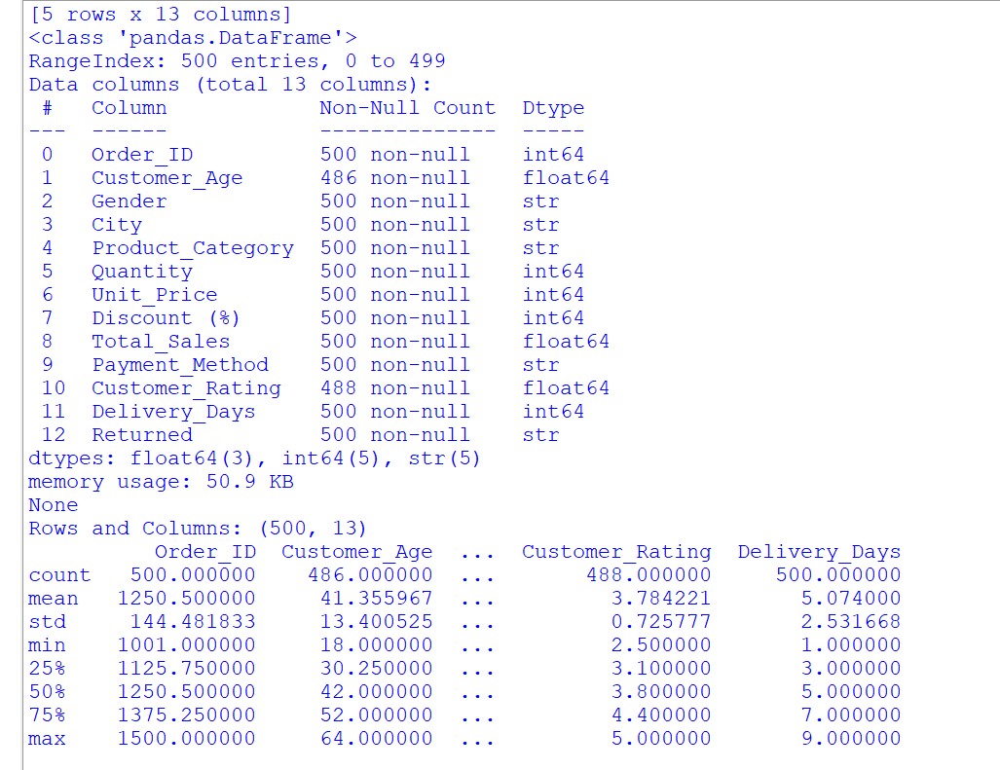
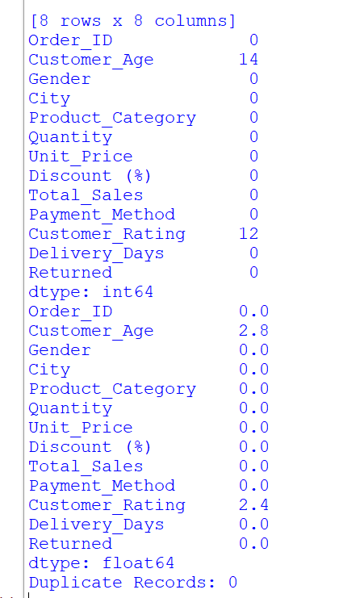
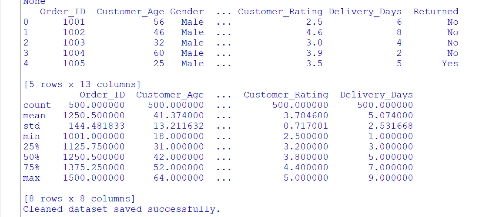
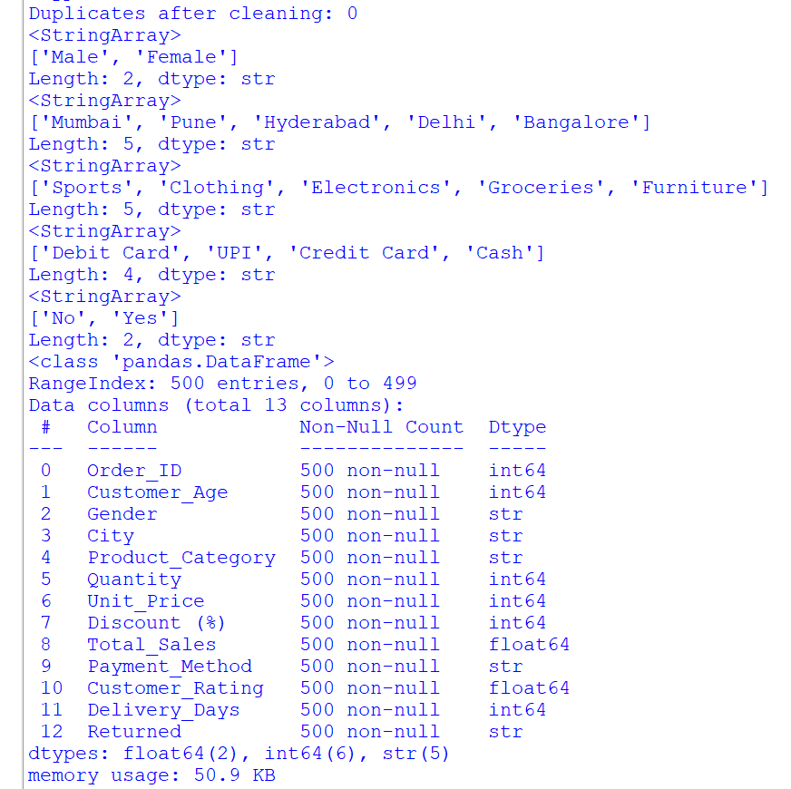

# CODSOFT_TASK1
DATA CLEANING &amp; PREPROCESSING
# 🧹 Data Cleaning and Preprocessing using Python

<p align="center">
  
</p>

## 📌 Project Overview

This project demonstrates the complete **Data Cleaning and Preprocessing** workflow using **Python** and **Pandas**. The dataset was inspected, cleaned, and prepared for further analysis by handling missing values, removing duplicates, correcting data types, and standardizing inconsistent entries.

---

## 🎯 Objectives

- Import and inspect the dataset
- Identify missing values
- Detect duplicate records
- Check and correct data types
- Handle inconsistent data entries
- Prepare the dataset for analysis
- Save the cleaned dataset as a new CSV file

---

## 🛠️ Technologies Used

- Python
- Pandas
- NumPy

---

## 📂 Project Files

```
├── README.md
├── data_cleaning.py
├── Retail_Sales_EDA_Dataset.csv
├── Retail_Sales_Cleaned.csv
├── task1.png
├── duplicate.png
├── cleaneddataset.png
└── aftercleaning.png
```

---

# 📊 Dataset Preview

<p align="center">
  
</p>

The dataset contains retail sales information including customer details, product categories, sales amount, discounts, ratings, and delivery information.

---

# 🔍 Duplicate Records Detection

<p align="center">
  
</p>

### ✔ Operations Performed

- Checked duplicate rows using `duplicated()`
- Counted duplicate records
- Removed duplicates using `drop_duplicates()`

---

# 🧹 Cleaned Dataset

<p align="center">
  
</p>

### ✔ Data Cleaning Steps

- Filled missing values
- Removed duplicate records
- Corrected data types
- Standardized categorical values
- Verified dataset consistency

---

# ✅ Final Dataset After Cleaning

<p align="center">
  
</p>

The final dataset is free from missing values and duplicate records, making it suitable for visualization, statistical analysis, and machine learning.

---

# 🔧 Data Cleaning Process

✔ Imported dataset using Pandas

✔ Inspected dataset structure

✔ Checked missing values

✔ Identified duplicate records

✔ Removed duplicates

✔ Filled missing values

✔ Corrected data types

✔ Standardized inconsistent values

✔ Saved cleaned dataset as a new CSV file

---

# 📈 Results

| Task | Status |
|------|--------|
| Dataset Imported | ✅ |
| Data Inspection | ✅ |
| Missing Values Handled | ✅ |
| Duplicate Records Removed | ✅ |
| Data Types Corrected | ✅ |
| Dataset Cleaned | ✅ |
| Cleaned CSV Generated | ✅ |

---

# 📁 Output

The cleaned dataset is exported as:

```
Retail_Sales_Cleaned.csv
```

---

# 🚀 Skills Demonstrated

- Data Cleaning
- Data Preprocessing
- Data Inspection
- Missing Value Handling
- Duplicate Detection
- Data Type Conversion
- Pandas
- Python

---

# 📌 Conclusion

The dataset was successfully cleaned and transformed into a structured format suitable for further **Exploratory Data Analysis (EDA)**, **Data Visualization**, and **Machine Learning**. This preprocessing step ensures higher data quality and improves the reliability of future analyses.

---

## 👩‍💻 Author

**Manasvi Ahire**

**Data Analytics Intern**

